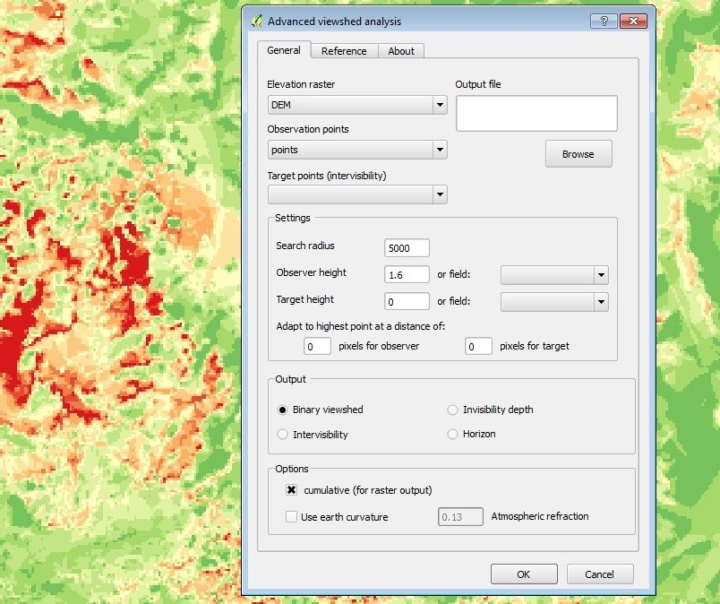

Quantum GIS plugin for visibility analysis
======================

## Introduction
Viewshed analysis plugin for QGIS calculates visible surface from a given observer point over a digital elevation model. The plugin is intended for more complex modelling, such as the depth below the visible horizon or generation of intervisibilty networks between groups of points. It is particularly performant for multiple viewshed calculations form a set of fixed points.

## Current stable version: 0.5.2 
- Supported QGIS version: 2.x
- [**Help & documentation**](https://zoran-cuckovic.github.io/QGIS-visibility-analysis/help_qgis2.html)

## Current experimental version: 0.6 
- Supported QGIS version: 3.x
- [**Help & documentation**](https://zoran-cuckovic.github.io/QGIS-visibility-analysis/help_qgis3.html)
  
Licence: GNU GPL v.3  

## More information

You can signal an issue at **[GitHub](https://github.com/zoran-cuckovic/QGIS-visibility-analysis/issues)**

For further information on algorithms used, case studies etc. take a look at **[zoran-cuckovic.from.hr](http://zoran-cuckovic.from.hr)** .

Data used for testing and tutorials can be found **[here](https://github.com/zoran-cuckovic/QGIS-visibility-analysis/tree/test-data/)**.

Qgis visibility analysis maintained by [zoran-cuckovic](https://github.com/zoran-cuckovic)

Homepage: [zoran-cuckovic.from.hr](http://zoran-cuckovic.from.hr)

## Archive 

- [July 15, 2018]( https://landscapearchaeology.org/2018/visibility-test-nuraghi/): Testing perfomance of 0.6 version

- [July 3, 2018](http://landscapearchaeology.org/2018/visibility-analysis-0-6/): 0.6 version - compatible with QGIS 3 

- [December 22, 2016](http://www.zoran-cuckovic.from.hr/2017/12/qgis-visibility-054.html) : Visibility analysis, release 0.5.4: modelling the horizon

- [July 30, 2016](http://www.zoran-cuckovic.from.hr/2017/12/qgis-visibility-analysis-algorithm.html): QGIS visibility analysis algorithm

- [July 27, 2016](http://www.zoran-cuckovic.from.hr/2016/07/viewshed-tutorial.html ): QGIS viewshed plugin: a tutorial
