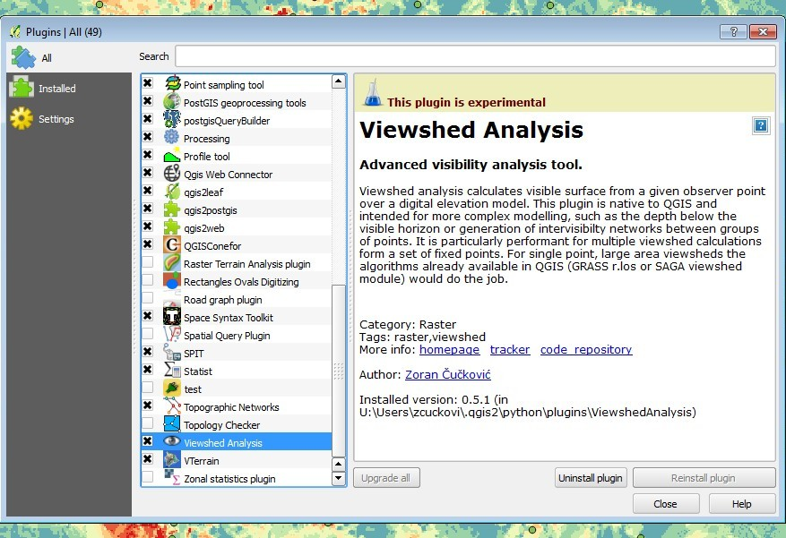
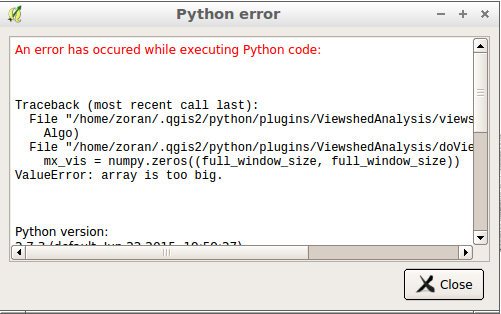

[View on GitHub](https://github.com/zoran-cuckovic/QGIS-visibility-analysis)

Quantum GIS plugin for visibility analysis
======================

[Download this project as a .zip file](https://github.com/zoran-cuckovic/QGIS-visibility-analysis/zipball/master) [Download this project as a tar.gz file](https://github.com/zoran-cuckovic/QGIS-visibility-analysis/tarball/master)

### Current stable version: 0.5.2 
### Current experimental version: 0.6 

Supported QGIS version: 2.x (stable version), 3 (experimental)  
Licence: GNU GPL v.3  

### Contents: stable version

1.  **[Installation](#1a)**
2.  **[Input/output and features](#1)**
3.  **[Common problems](#3)**
4.  **[More information](#4)**

1\. Installation
----------------

The plugin is installed as any other from the official QGIS repository (In QGIS go to _Plugins -> Manage and install_ ... ). Be sure to enable experimental versions if the latest plugin version is labelled as experimental.

In case the usual install doesn't work, the plugin can be installed manually:

First you need to locate your QGIS plugins folder. On windows it would be `C:\users\username\.qgis2\python\plugins` and on Linux something like `~/home/.qgis2/python/plugins`. (do a file search for `.qgis2`)

Plugin code can then be extracted in a new folder inside the plugins folder (you should name the folder ViewshedAnalysis). Take care that the code is not inside a subfolder - the folder structure should be like this:

.qgis2\\python\\plugins  
├─── \[some QGIS plugin folders...\]  
├─── **ViewshedAnalysis**  
       ├── viewshedanalysis.py  
       ├── \[other files and folders...\]  

Click above to download the latest version (older versions can be found at [QGIS plugins repository](https://plugins.qgis.org/plugins/ViewshedAnalysis/) ).

Be sure to enable the plugin in Plugins manager: it should then be visible in **Plugins menu**. 

2\. Input and features
----------------------

### Data

_Raster layer_

This can be any supported raster format, normally a terrain elevation model. Resulting viewshed model has the same resolution and extent as the original terrain data: for better performance and for convenience the _terrain model should be cropped_ to the analysed area. Raster data format has to match the format of parameters: e.g. parameters specified in metres over a raster in degrees will not make a sensible result.

_Observer points_

Observer points have to be stored in a shapefile or other recognised vector formats. Lines or polygons cannot be used (unless broken up in points).

The coordinate reference systems of the elevation raster and the observer/target point(s) _must match_. There is no 'on the fly reprojection' or whatever: the best practice is to turn off automatic reprojection to test whether things overlap as they should.

Unless _cumulative output_ is chosen in algorithm options, a viewshed raster will be produced for each point. Files will be named using an internal Id number or by value specified in **ID** column in the associated data table, in case such field exists. Take care that these values be unique (no warning is issued if otherwise!).

_Target points_

This option is used for intervisibility analysis only. Target points behave the same way as observer points.

### Settings

A basic requirement in viewshed modelling is setting up height values for both the observer and the target. For instance we might be interested whether a building 20 metres tall (**target height**) would be visible by an average pedestrian with eye-level at 1.6 metres (**observer height**).

Observer/target height values can be read from shapefile's data table for each observer or target point (a valid **table field** has to be chosen in the dropdown list). In case of error (eg. an empty field) the global value specified in the text box will be applied.

**Search radius** is the size of the analysed area around each observer point.

**Adapt to the highest point**: often it is desirable to perform a local search for a higher observation point. The search is made in a quadrangular window where the observer point is in the middle.

### Output

**Viewshed** will produce a standard true/false (binary) raster. Multiple viewsheds can be combined in a one raster layer using the **cumulative option**, otherwise a single file will be saved for **each observer point**.

A network of visual relationships between two sets of points (or within a single set) can be obtained with the **intervisibility** option. For each link the depth below/above horizon and the length are calculated. All possible links are shown in the output - the information on whether a link is successful is contained in the **"Visible" column** of the produced shapefile.

Using the **invisibility depth** we can measure the depth of terrain below the lowest possible line of sight. However, when this option is used with the target height the measurement is made from the top of the target (terrain + target): in cases when the target is partially occluded we obtain its apparent height.

**Horizon** is the last visible place on the terrain, which corresponds to fringes of visible zones. Here the horizon analysis will provide outer fringes of _all visible patches_ (to be refined in future).

### Algorithm options

_Cumulative output_

This options sums up all viewsheds from specified observer points into a single raster.

_Earth curvature and light refraction_

Similar to other viewshed algorithms available, it is possible to account for effects of the Earth's curvature and refraction of the light when travelling through the atmosphere. Following formula is used to adjust height values in the DEM:

z adjusted = z - (Dist 2 / Diam Earth ) \* (1 - Refraction)

Where:  
Dist: The planimetric distance between the observation point and the target point.  
Refraction: The refractivity coefficient of light (normally it has the opposite, but smaller, effect than the curvature).  
Diam: The diameter of the earth that is calculated as Semi-major axis + Semi-minor axis. These values are taken from the projection system assigned to the Raster by QGIS. In case of error or unrealistic values, the default Semi-major axis of 6378137 meters and flattening of 298.257 are used.

For more explanation cf. [ArcGIS web page](http://webhelp.esri.com/arcgisdesktop/9.3/index.cfm?TopicName=How%20Visibility%20works)

_Precision_

Three levels of precision to speed ratio are available:  

*   Coarse: no interpolation between pixels, lines of sight are cast to the specified perimeter.
*   Normal: values are interpolated between pixels, lines of sight are cast to the specified perimeter.
*   Fine: values are interpolated between pixels, lines of sight are cast to artificially enlarged perimeter (two times the specified value).

For more explanation cf. [project site](http://zoran-cuckovic.from.hr/landscape-analysis/visibility)

3\. Common problems
-------------------

*   There is **no transformation of coordinate reference systems** between the raster DEM and the observation/target points shapefile. In order to check whether they match properly simply disable 'on-the-fly' transformation.
*   **Special/international characters** (e.g. ç, é, č, đ ...) are not supported for file names (or folder names).
*   The observer/target points are approximated to **the centre of pixels** they occupy: there is no need for super-precision.
*   The speed of execution is related primarily to the **radius of analysis**, and then to the complexity of chosen options and overall size of the DEM used.
*   The module loads the entire chunk of data to be analysed into memory: the volume of the analysis is limited by your hardware resources. Some options may be more memory hungry, such as target height offset or Earth's curvature calculation. Consider using Grass viewshed modules for calculations over large datasets.

  
Viewshed plugin will raise an error when using too large datasets.

### More information

You can signal an issue at **[GitHub](https://github.com/zoran-cuckovic/QGIS-visibility-analysis/issues)**

For further information on algorithms used, case studies etc. take a look at **[zoran-cuckovic.from.hr](http://zoran-cuckovic.from.hr)** .

Data used for testing and tutorials can be found **[here](https://github.com/zoran-cuckovic/QGIS-visibility-analysis/tree/test-data/)**.

Qgis visibility analysis maintained by [zoran-cuckovic](https://github.com/zoran-cuckovic)

Homepage: [zoran-cuckovic.from.hr](http://zoran-cuckovic.from.hr)
